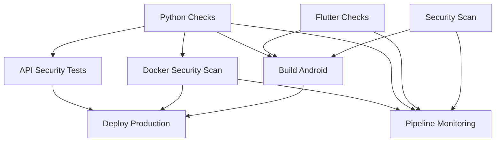

# 🛡️ Security CI/CD Guide for Tug Application

This document provides comprehensive guidance on the enhanced security-focused CI/CD pipeline implemented for the Tug application.

## 📋 Table of Contents

1. [Security Scanning Overview](#security-scanning-overview)
2. [Pipeline Architecture](#pipeline-architecture)
3. [Security Tools Configuration](#security-tools-configuration)
4. [Quality Gates and Thresholds](#quality-gates-and-thresholds)
5. [Environment-Specific Deployments](#environment-specific-deployments)
6. [Monitoring and Alerting](#monitoring-and-alerting)
7. [Secrets Management](#secrets-management)
8. [Performance Testing](#performance-testing)
9. [Troubleshooting Guide](#troubleshooting-guide)
10. [Best Practices](#best-practices)

## 🔍 Security Scanning Overview

Our CI/CD pipeline integrates multiple security scanning tools to ensure comprehensive coverage:

### Static Code Analysis
- **Bandit**: Python security vulnerability scanner
- **Semgrep**: Multi-language security pattern detection
- **Safety**: Python dependency vulnerability scanner
- **PyLint**: Code quality and potential security issues

### Container Security
- **Trivy**: Comprehensive Docker image vulnerability scanner
- **Multi-stage Dockerfile**: Reduces attack surface and image size

### Dynamic Security Testing
- **OWASP ZAP**: Dynamic Application Security Testing (DAST)
- **API Security Testing**: Automated security testing of REST endpoints

### Dependency Management
- **Dependabot**: Automated dependency updates
- **License Compliance**: Monitoring of dependency licenses

## 🏗️ Pipeline Architecture

### Job Dependencies and Parallelization



### Security-First Approach
1. **Security scans run in parallel** for faster feedback
2. **Quality gates prevent deployment** of vulnerable code
3. **Multiple security layers** provide defense in depth
4. **Automated reporting** ensures visibility

## ⚙️ Security Tools Configuration

### Bandit Configuration (`.bandit`)
```toml
[bandit]
exclude_dirs = /backend/tests,/backend/migrations
confidence = MEDIUM
severity = MEDIUM
format = json
```

Key features:
- Excludes test directories from scanning
- Configurable confidence and severity levels
- JSON output for automated processing

### Safety Configuration (`.safety-policy.json`)
```json
{
  "security": {
    "ignore-cvss-severity-below": 7.0,
    "continue-on-vulnerability-error": false
  }
}
```

Key features:
- CVSS severity threshold of 7.0 (High)
- Fails build on security vulnerabilities
- Supports vulnerability whitelisting for false positives

### Semgrep Configuration
- Uses community rules for comprehensive coverage
- Custom ignore patterns in `.semgrepignore`
- Focuses on security-relevant code patterns

### OWASP ZAP Configuration (`.zap/rules.tsv`)
- Custom rules for API security testing
- Reduced false positives for REST APIs
- Focused on critical security issues

## 🚪 Quality Gates and Thresholds

### Code Coverage
- **Minimum threshold**: 60%
- **Enforcement**: Pipeline fails if coverage drops below threshold
- **Reporting**: HTML, XML, and terminal coverage reports

### Security Vulnerability Limits
- **Docker vulnerabilities**: Maximum 5 HIGH/CRITICAL
- **Python dependencies**: CVSS score threshold of 7.0
- **Code security**: Medium confidence level minimum

### Performance Baselines
- **Response time**: Warning if average > 1000ms
- **Failure rate**: Warning if > 5%
- **Load testing**: Baseline performance monitoring

## 🌍 Environment-Specific Deployments

### Staging Environment
- **Trigger**: Pushes to `develop` branch
- **Purpose**: Integration testing and validation
- **Security**: Full security scans required
- **Smoke tests**: Automated post-deployment validation

### Production Environment
- **Trigger**: Pushes to `main` branch
- **Purpose**: Live application deployment
- **Security**: All security gates must pass
- **Rollback**: Automatic rollback on health check failure
- **Monitoring**: Enhanced monitoring and alerting

### Manual Deployments
- **Workflow dispatch**: Manual trigger with environment selection
- **Security validation**: Same security requirements as automated
- **Approval gates**: Production deployments require manual approval

## 📊 Monitoring and Alerting

### Pipeline Monitoring
- **Real-time status**: Continuous monitoring of job status
- **Failure detection**: Automatic detection of critical failures
- **Issue creation**: Auto-generated GitHub issues for critical failures

### Security Drift Monitoring
- **Daily scans**: Automated security updates checking
- **Dependency health**: Regular dependency health assessments
- **Vulnerability tracking**: Continuous monitoring for new CVEs

### Performance Monitoring
- **Baseline testing**: Regular performance baseline validation
- **Regression detection**: Automatic detection of performance regressions
- **Resource monitoring**: Container and application resource usage

### Notification Channels
- **Slack**: Real-time pipeline notifications
- **GitHub Issues**: Automatic issue creation for critical failures
- **Email**: Security alert notifications

## 🔐 Secrets Management

### Required Secrets

#### Docker Hub
- `DOCKERHUB_USERNAME`: Docker Hub username
- `DOCKERHUB_TOKEN`: Docker Hub access token

#### Deployment Environments
- `STAGING_HOST`: Staging server hostname
- `STAGING_USERNAME`: Staging server SSH username
- `STAGING_SSH_KEY`: Staging server SSH private key
- `STAGING_URL`: Staging application URL
- `PROD_HOST`: Production server hostname
- `PROD_USERNAME`: Production server SSH username
- `PROD_SSH_KEY`: Production server SSH private key
- `PROD_URL`: Production application URL

#### Application Secrets
- `FIREBASE_CREDENTIALS`: Firebase service account credentials
- `MONGODB_URL`: Database connection string (if needed)

#### Notification Services
- `SLACK_WEBHOOK_URL`: Slack webhook for notifications
- `DISCORD_WEBHOOK_URL`: Discord webhook for notifications

#### Mobile App Signing (Optional)
- `ANDROID_KEYSTORE_BASE64`: Base64 encoded Android keystore
- `ANDROID_KEY_ALIAS`: Android signing key alias
- `ANDROID_KEY_PASSWORD`: Android signing key password

### Security Best Practices
1. **Environment-specific secrets**: Different secrets for staging/production
2. **Principle of least privilege**: Minimal required permissions
3. **Regular rotation**: Periodic secret rotation schedule
4. **Audit logging**: Track secret usage and access

## 🚀 Performance Testing

### Load Testing with Locust
- **Automated execution**: Performance tests run in CI/CD
- **Multiple user types**: Different user behavior patterns
- **Performance thresholds**: Automated threshold checking
- **Baseline monitoring**: Regular performance baseline validation

### Test Scenarios
1. **Normal User**: Typical application usage patterns
2. **Heavy Read User**: Analytics and browsing patterns
3. **Admin User**: Administrative operations
4. **Spike Testing**: Traffic spike simulation

### Performance Metrics
- **Response time**: Average and percentile response times
- **Throughput**: Requests per second capacity
- **Error rate**: Failure rate under load
- **Resource utilization**: CPU and memory usage

## 🔧 Troubleshooting Guide

### Common Pipeline Issues

#### Security Scan Failures
**Problem**: Bandit, Safety, or Semgrep failures
**Solutions**:
1. Review security scan reports in artifacts
2. Address legitimate security issues
3. Whitelist false positives in configuration files
4. Update dependencies to secure versions

#### Test Coverage Below Threshold
**Problem**: Code coverage drops below 60%
**Solutions**:
1. Add tests for uncovered code paths
2. Remove dead code
3. Adjust coverage configuration if needed
4. Review coverage reports for specific areas

#### Docker Security Issues
**Problem**: Trivy finds HIGH/CRITICAL vulnerabilities
**Solutions**:
1. Update base images to latest versions
2. Remove unnecessary packages
3. Use distroless images where possible
4. Review Dockerfile security best practices

#### Deployment Failures
**Problem**: Deployment to staging/production fails
**Solutions**:
1. Check server connectivity and credentials
2. Verify Docker image availability
3. Review application logs
4. Check health endpoint responses

### Pipeline Performance Issues

#### Slow Build Times
**Solutions**:
1. Review cache utilization
2. Optimize Docker layer caching
3. Parallelize independent jobs
4. Remove unnecessary dependencies

#### Resource Constraints
**Solutions**:
1. Monitor GitHub Actions usage limits
2. Optimize resource-intensive jobs
3. Consider self-hosted runners for heavy workloads

## 📚 Best Practices

### Security
1. **Security-first mindset**: Security scans run early and fail fast
2. **Multiple layers**: Defense in depth with multiple security tools
3. **Regular updates**: Keep security tools and dependencies updated
4. **Continuous monitoring**: Monitor for new vulnerabilities
5. **Documentation**: Maintain security documentation and runbooks

### Code Quality
1. **Comprehensive testing**: Unit, integration, and security tests
2. **Code coverage**: Maintain high code coverage standards
3. **Static analysis**: Regular code quality analysis
4. **Performance monitoring**: Monitor application performance

### Deployment
1. **Environment parity**: Keep environments consistent
2. **Automated testing**: Comprehensive automated testing
3. **Rollback capability**: Always have rollback procedures
4. **Health monitoring**: Monitor application health post-deployment

### Monitoring
1. **Real-time alerting**: Immediate notification of critical issues
2. **Historical tracking**: Track metrics over time
3. **Capacity planning**: Monitor resource usage trends
4. **Incident response**: Clear incident response procedures

## 📈 Continuous Improvement

### Regular Reviews
- **Monthly**: Security tool configuration review
- **Quarterly**: Pipeline performance optimization
- **Bi-annually**: Security practices and standards review

### Metrics and KPIs
- **Security**: Number of vulnerabilities detected and resolved
- **Quality**: Test coverage trends and code quality metrics
- **Performance**: Build times and deployment frequency
- **Reliability**: Pipeline success rate and failure patterns

### Feedback Loop
- **Developer feedback**: Regular feedback on pipeline usability
- **Security team input**: Security requirements and standards
- **DevOps optimization**: Continuous pipeline improvements
- **Tool evaluation**: Regular evaluation of new tools and practices

---

## 📞 Support and Resources

### Internal Resources
- **DevOps Team**: Pipeline configuration and optimization
- **Security Team**: Security standards and vulnerability management
- **Development Teams**: Application-specific testing and quality

### External Resources
- **OWASP**: Security testing standards and best practices
- **NIST**: Security framework and guidelines
- **GitHub Actions**: Documentation and best practices
- **Tool Documentation**: Specific tool configuration guides

---

*This guide is a living document and should be updated as the pipeline evolves and new security practices are adopted.*